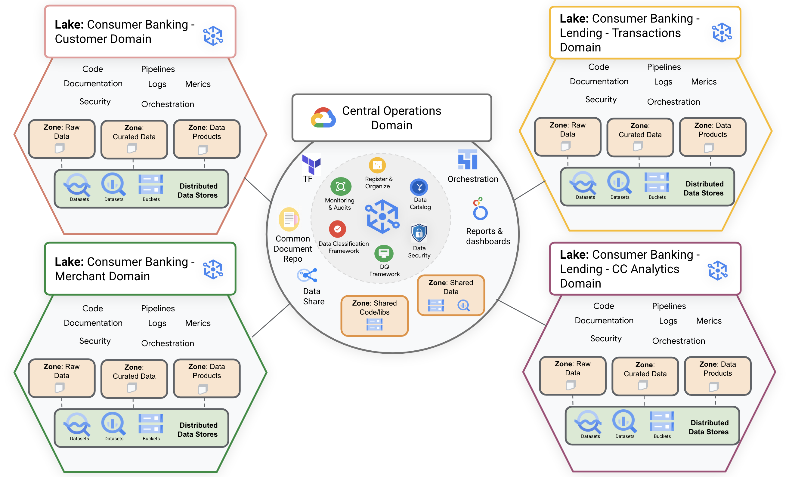
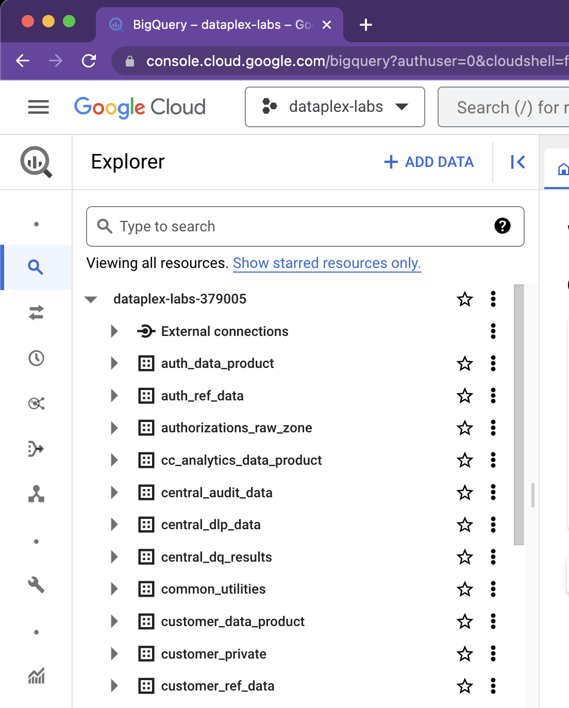

# Cloud Dataplex Self-service labs

## 1. About
Google Cloud Dataplex is an intelligent data fabric that helps you unify distributed data and automate data management and governance across that data to power analytics at scale.

In this self-service lab, you will discover how to build and maintain an end-to-end data mesh based on a financial services use case with data from multiple domains. You will start by creating domain-specific lakes and zones out of the distributed data saved across GCS buckets and BQ datasets. Use Dataplex to manage data security and to build products involving data curation, data migration, data quality, data classification, and business and technical metadata harvesting, cataloging and tagging. Also includes automation using terraform and Google Cloud composer(Airflow).

The labs will guide you through building a Data mesh using Dataplex's data governance and management capabilities and is based on data journey of a fictious bank called "Bank of Mars".

### 1.2. Process Flow 


### 1.3. Data Flow 


### 1.3. Data Domains and Asset Mapping


### 1.4. Data Mesh high level architecture



## 2. Setup 

### 2.1 The setup flow
<br>


<br>

### 2.2 Pre-requisites

1. Create a GCP Project <br>
2. Grant the terraform user or service account the below IAM policies at the project level
         - Owner
        - ServiceAccountTokenCreator
        - Organization Admin
        
For Argolis environment, use "admin@" account
3. If VPC SC is enabled in your organization, the project must belong to the same [VPC Service Control perimeter](https://cloud.google.com/vpc-service-controls/docs/service-perimeters) as the data destined to be in the lake. Refer to this link to use or [add Dataplex to VPC-SC](https://cloud.google.com/dataplex/docs/vpc-sc). 
Ignore this for argolis account. 
4. Make sure **us-central1** is allowed under your organization regions policy. Ignore for argolis. 
5. For non-argolis accounts, the below org policies should be set at the project level before triggering the setup:<br>
    - "compute.requireOsLogin" : false,
    - "compute.disableSerialPortLogging" : false,
    - "compute.requireShieldedVm" : false
    - "compute.vmCanIpForward" : true,
    - "compute.vmExternalIpAccess" : true,
    - "compute.restrictVpcPeering" : true
    - "compute.trustedImageProjects" : true,
    - "iam.disableCrossProjectServiceAccountUsage" :false #Only required when you want to set up in a separate project to your data project
6. Make sure you have enough of disk space(1.5 GB - 2 GB)  for the terraform setup 

### 2.2 Run the Terraform Script 

Follow the below steps to trigger the terraform setup

#### 2.2.1. [](https://console.cloud.google.com/cloudshell/editor)

#### 2.2.2.  Select the appropriate project. Make sure you are in the right project before you proceed. 

#### 2.2.3. Install the below python libraries 

```bash
pip3 install google-cloud-storage
pip3 install numpy 
pip3 install faker_credit_score
```

#### 2.2.4 Declare variable 
In cloud shell, declare the following variables after substituting with yours. 
- For Argolis, use fully qualified corporate email address - ldap@google.com otherwise use your fully qualified email address (e.g. joe.user@gmail.com) as the USERNAME

    ```bash
    echo "export USERNAME=your-email" >> ~/.profile
    ```
  
- Set the PROJECT_ID

    ```bash
    echo "export PROJECT_ID=$(gcloud config get-value project)" >> ~/.profile
    ```
    


#### 2.2.5. Validate the user

To get the currently logged in email address, run: 'gcloud auth list as' below:

    ```bash 
    gcloud auth list
    Credentialed Accounts

    ACTIVE: *
    ACCOUNT: joe.user@jgmail.com or admin@(for Argolis)
    ```

#### 2.2.6. Clone this repository in Cloud Shell
   ```bash 
   git clone https://github.com/mansim07/dataplex-labs.git
   ```

#### 2.2.7. Trigger the terraform script to setup the lab environment 
For Argolis: <br>

```
cd ~/dataplex-labs/setup/
source ~/.profile
bash deploy-helper.sh ${PROJECT_ID} ${USERNAME} argolis
 ```

For Non-Argolis or external: <br>
``` 
cd ~/dataplex-labs/setup/
source ~/.profile
bash deploy-helper.sh ${PROJECT_ID} ${USERNAME}  external
```

The script will take about 30-40 minutes to finish.

### 2.3. Explore the resource provisioned

#### 2.3.1. Validate the GCS buckets

```
export PROJECT_ID=$(gcloud config get-value project)
gsutil cat gs://${PROJECT_ID}_customers_raw_data/customers_data/dt=2022-12-01/customer.csv | head -2
```

#### 2.3.2. Validate the BQ datasets

Go to BigQuery UI -> validate the datasets as shown below are created<br>



#### 2.3.3. Validate the Dataplex lakes and zones 

 Go to Dataplex -> Manage -> Verify lakes and assets are created as per the below screenshot<br>
 

#### 2.3.4. Validate Composer environment

Go to Composer… Then Environments…  Click on <your-project-id>-composer link..then click on 'Environment Variables'<br>


<hr>

If all the above validations pass, you're setup is not complete. Please proceed to the Labs.

## 3. Labs 

### 3.1. Lab Flow


### 3.2. Lab Details
We have a series of labs designed to get hands-on-experience with Dataplex concepts. Please refer to each of the lab specific README for more information on the labs.

| Lab# |  Title | Description | 
| ------------------ | ------------------- | ------------- | 
| [Lab1](/lab1-data-organization/README.md )  | Data Organization  | Organize the Customer specific data assets into lakes and zones and map the underlying buckets and datasets assets| 
| [Lab2](/lab2-data-security/README.md)  | Manage Data Security using Dataplex  | Managing Data Security is the main goal of this lab. You will learn how to design and manage security policies using Dataplex's UI and REST API as part of the lab. The purpose of the lab is to learn how to handle distributed data security more effectively across data domains|   |
| [Lab3](/lab3-data-curation/README.md)  | Standardize data using Dataplex built in task | You will discover how to leverage common Dataplex templates to curate raw data and translate it into standardized formats like parquet and Avro in the Data Curation lane. This demonstrates how domain teams may quickly process data in a serverless manner and begin consuming it for testing purposes.|[  |
|  [Lab4](/lab4-build-data-products/README.md)   | Build Data Products | Serverless Dataplex tasks offer with open, simple APIs that make it easier to integrate them with already-existing Data pipelines, which makes them complementary in nature. In this lab, you will discover how to integrate Dataplex functionalities with your data product engineering pipeline.  We will use  [Configuration-driven Serverless Dataproc Templates](https://github.com/GoogleCloudPlatform/dataproc-templates) for incremental data using from GCS to BQ, incorporate a Dataplex's data quality task to verify the raw data and then transform data use for building data products. | |
| [Lab5](/lab5-data-classification/README.md) | Data Classification using DLP | You will use DLP Data Profiler in this lab so that it can automatically classify the BQ data, which will then be used by a Dataplex for building data classification tags. |  |
| [Lab6](/lab6-data-quality/README.mde) | Data Quality |  in this lab you will learn how to execute an end-to-end data quality process, including how to define **DQ rules**, assess and **analyze** DQ findings, build an dq analysis **dashboard**, manage DQ **incidents**, and finally publish DQ score **tags** to the catalog.  | 
|[Lab7](/lab7-register-data-products/README.md) | Tag template and bulk tagging | In this lab, you will learn how to create business metadata tags on the Dataplex Data Product entity at scale across domains using custom utilities and Composer. | 
| [Lab8](/lab8-data-discovery-lineage/README.md) | Data catalog Search and Data Lineage| You will learn how to find data using the logical structure, perform advanced data discovery, provide additional(wiki-style) product overview and look at Data lineage |  
| [Lab9](/lab9-data-profiling/README.md) | Data profiling| You will learn how to run data profiling tasks on BigQuery tables to better understand data for cleansing, and analyzing | 


## 4. Contributing
TBD

## 5. License
Please make sure you clean up your environment

## 6. Disclaimer 

## 7. Contact
Share you feedback, ideas, by logging [issues](https://github.com/mansim07/dataplex-labs/issues).

## 8. Credits 

| # | Google Cloud Collaborators | Contribution  | 
| -- | :--- | :--- |
| 1. | Mansi Maharana   | Creator |
| 2. | Jay O'leary | Initial terraform setup |
| 3. | Anagha Khanolkar | Data profiling Lab, best practices, feedback, code reviews |
| 4. | Sam Iyer | Version#1 Data curation and data quality labs  |


## 9. Release History
| Date | Release Summary |  Contributor |
| -- | :--- | :--- |
| 20220108 | Initial Script - Terraform, Lab1-8|  Mansi Maharana|
| 20220122 | Lab 9 Data Profiling| Anagha Khanolkar|
| 20220126 | 1. Extended it for external implementation.<br> 2. Added addditional documentation <br> 3. Fixed the networking issue with "default" <br> 4. Added a new lab on Data Organization  | Mansi Maharana|